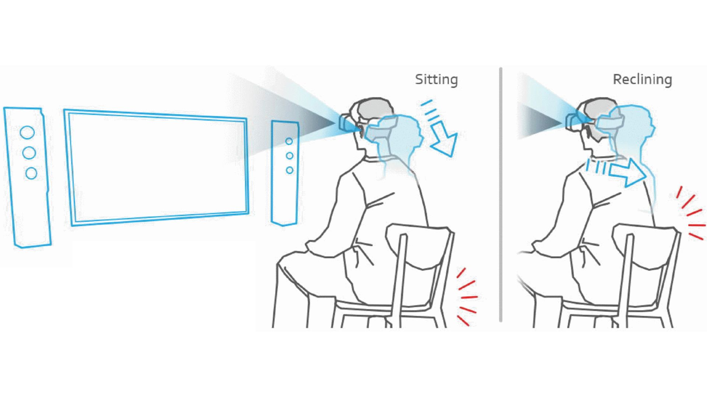

### Procedure: Setting Up a Head Mounted Display (HMD) for Virtual Reality (VR)

The setup of a Head Mounted Display (HMD) for Virtual Reality (VR) involves configuring the device for optimal comfort and immersion across various postures, such as sitting, reclining, standing, or moving. Below is a detailed guide to setting up an HMD, with specific attention to the schematics shown in the referenced image (sitting and reclining positions) and additional demonstrations for standing and moving postures. The process ensures safety, comfort, and an immersive VR experience tailored to different use cases.

**Img. 1**: Image of Head Mounted Display in Sitting and Reclining Position.

---

### Detailed Writeup of Schematics: Sitting and Reclining Positions

The referenced image illustrates two primary postures for using a VR HMD: **sitting** and **reclining**. Below is a detailed description of each posture, including setup considerations, ergonomic adjustments, and use case examples.

#### **1. Sitting Position**
**Description**: In the sitting position, the user is seated upright in a chair, with the HMD securely fitted on the head. The controllers are held in both hands, and the play area is typically set to a stationary boundary to minimize physical movement. The HMD’s display is aligned with the user’s eyes, and the straps are adjusted to ensure a snug fit without pressure on the face.

**Setup Details**:
- **Environment**: Choose a stable, comfortable chair with adequate back support. Ensure the play area (minimum 1m x 1m) is free of obstacles, such as tables or sharp edges, to prevent accidental contact during subtle movements.
- **HMD Adjustment**: Adjust the head straps to position the HMD’s lenses directly over the eyes. Use the interpupillary distance (IPD) slider (e.g., 53–75mm on Meta Quest 3) to align with the user’s eye spacing for clear visuals. The headset should rest lightly on the cheeks and forehead.
- **Controller Positioning**: Hold controllers naturally, with elbows bent at a comfortable angle (approximately 90 degrees). For headsets like the Valve Index, ensure Knuckles controllers are strapped to the hands for secure grip.
- **Boundary Setup**: Set the VR system to stationary mode (e.g., Meta Quest’s Guardian or SteamVR’s seated boundary). This restricts tracking to a small area, ideal for seated experiences like VR movies or simulations.
- **Use Case Example**: The sitting position is ideal for applications like *Oculus TV* on Meta Quest 3, where users watch virtual cinema screens, or *Tilt Brush* for seated VR art creation. For instance, a user can comfortably engage in a virtual meeting using *Horizon Workrooms*, maintaining focus without physical exertion.

**Ergonomic Considerations**:
- Ensure the chair height allows feet to rest flat on the floor to reduce strain.
- Take breaks every 30–45 minutes to prevent neck stiffness or eye fatigue.
- Adjust the HMD’s weight distribution using optional counterweights (e.g., for Meta Quest) to minimize pressure on the face.

#### **2. Reclining Position**
**Description**: In the reclining position, the user leans back in a chair or lies on a recliner, with the HMD positioned to maintain alignment with the eyes. The posture is relaxed, with minimal arm movement, and controllers may rest on the lap or be used sparingly. This setup is suitable for passive or low-interaction VR experiences.

**Setup Details**:
- **Environment**: Use a reclining chair or sofa with adjustable backrest (e.g., 30–45-degree recline). Ensure the play area is clear of objects above or around the user to avoid accidental contact if the head moves.
- **HMD Adjustment**: Tighten the side straps slightly to prevent the HMD from sliding upward during reclining. Align the lenses with the eyes, and adjust the IPD to maintain visual clarity. For headsets like the PlayStation VR2, use the scope adjustment button to fine-tune lens positioning.
- **Controller Positioning**: Controllers may be held loosely or placed on the lap, as reclining is suited for gaze-based or minimal-interaction apps. For example, HTC Vive Pro 2 users can enable hand-tracking for gesture-based controls, reducing reliance on controllers.
- **Boundary Setup**: Set a stationary boundary, as movement is minimal. For headsets like the Valve Index, SteamVR’s seated mode ensures tracking remains focused on head orientation rather than body movement.
- **Use Case Example**: The reclining position suits passive experiences like VR meditation apps (*MindVR*) or immersive storytelling (*Wolves in the Walls* on Oculus). For instance, *Netflix VR* allows users to watch shows in a virtual theater while reclining comfortably, mimicking a cinematic experience.

**Ergonomic Considerations**:
- Use a neck pillow to support the head and reduce strain during extended sessions.
- Ensure the HMD’s weight does not press on the nose or forehead; adjust top straps to distribute weight evenly.
- Limit sessions to 30–60 minutes to avoid disorientation from prolonged reclining in VR.

---

### Additional Postures: Standing and Moving

Beyond sitting and reclining, VR HMDs support **standing** and **moving** postures, which are ideal for active and room-scale experiences. Below are detailed setups for these postures, ensuring versatility across VR applications.

#### **3. Standing Position**
**Description**: In the standing position, the user stands upright, wearing the HMD and holding controllers in both hands. The posture allows for moderate movement, such as leaning or turning, within a defined boundary. It is suitable for interactive games or training simulations requiring upper-body motion.

**Setup Details**:
- **Environment**: Clear a play area of at least 2m x 2m to allow for safe movement. Remove trip hazards like rugs or cables. For PC-connected headsets (e.g., HTC Vive Pro 2), secure the link cable to prevent tripping.
- **HMD Adjustment**: Ensure the HMD is snug, with straps tightened to prevent shifting during head turns. Adjust the IPD for sharp visuals, especially for fast-paced apps. For Valve Index, use the IPD slider (58–70mm) and check alignment via the on-screen guide.
- **Controller Positioning**: Hold controllers at chest level, with elbows slightly bent. For Meta Quest 3, the Touch Plus controllers track naturally in standing mode, supporting 360-degree rotation.
- **Boundary Setup**: Configure a room-scale boundary using the VR system’s guardian feature (e.g., Meta Quest’s auto-scanning Guardian or SteamVR’s Chaperone). Ensure the boundary alerts the user if they approach physical obstacles.
- **Use Case Example**: Standing is ideal for games like *Beat Saber* on Meta Quest 3, where users swing controllers to slice musical blocks, or *Half-Life: Alyx* on Valve Index, which involves leaning and aiming in a virtual environment.

**Ergonomic Considerations**:
- Wear comfortable, non-slip shoes to maintain balance.
- Take breaks every 20–30 minutes to prevent leg fatigue or dizziness.
- Ensure proper ventilation, as standing in VR can increase body heat.

#### **4. Moving Position (Room-Scale)**
**Description**: The moving position involves full-body movement within a larger play area, allowing users to walk, crouch, or turn in VR. This posture maximizes immersion for dynamic games or simulations requiring physical navigation.

**Setup Details**:
- **Environment**: Clear a larger play area (minimum 2m x 2m, ideally 3m x 3m or more) free of obstacles. For headsets like HTC Vive Pro 2 or Valve Index, position base stations diagonally (up to 5–7m apart) for accurate tracking.
- **HMD Adjustment**: Secure the HMD tightly to prevent slipping during active movement. For PlayStation VR2, adjust the scope and IPD (55–71mm) to maintain clarity during rapid head turns.
- **Controller Positioning**: Controllers are held dynamically, often mimicking real-world actions (e.g., swinging a sword or aiming a gun). Valve Index’s Knuckles controllers excel here, with finger-tracking for precise interactions.
- **Boundary Setup**: Use a room-scale guardian or boundary system to define the play area. For Meta Quest 3, the Guardian system auto-detects walls and furniture, alerting users if they near boundaries. For Vive or Index, SteamVR’s Chaperone grid appears when approaching edges.
- **Use Case Example**: Room-scale is perfect for immersive games like *Superhot VR*, where users dodge and attack in slow-motion, or *Job Simulator* on Meta Quest, which encourages walking and interacting with a virtual office. Training apps like VR firefighter simulations also benefit from this setup.

**Ergonomic Considerations**:
- Wear athletic clothing and shoes to support dynamic movement.
- Take frequent breaks (every 15–30 minutes) to avoid overexertion or motion sickness.
- Ensure cables (if any) are managed to prevent entanglement, or opt for wireless headsets like Meta Quest 3 or Vive with a wireless adapter.

---

### CAUTION: Safety Considerations for VR Headsets

**General Safety Risks**:
- **Motion Sickness**: Prolonged VR use, especially in standing or moving positions, may cause nausea, dizziness, or disorientation. Start with short sessions (15–30 minutes) and stop if discomfort occurs.
- **Physical Collisions**: Improperly set boundaries can lead to collisions with walls, furniture, or objects, risking injury. Always clear the play area and activate the guardian or boundary system.
- **Eye Strain**: Extended use may cause eye fatigue or discomfort. Adjust IPD correctly and limit sessions to avoid strain.
- **Trip Hazards**: Cables for PC-connected headsets (e.g., Valve Index, HTC Vive) can cause tripping. Secure cables or use wireless setups where possible.
- **Health Conditions**: VR is not recommended for individuals with epilepsy, heart conditions, or severe motion sensitivity without medical consultation.

**Posture-Specific Safety Cautions**:
- **Sitting**: Ensure the chair is stable to avoid tipping during sudden movements. Avoid leaning too far forward to prevent HMD slippage.
- **Reclining**: Use a neck pillow to prevent strain, and avoid falling asleep with the HMD on, as it may cause discomfort or disorientation upon waking.
- **Standing**: Maintain balance to avoid falling, especially during fast-paced games. Ensure the floor is non-slip to prevent accidents.
- **Moving (Room-Scale)**: Be cautious of physical exertion, as room-scale VR can be physically demanding. Clear the area thoroughly, as collisions are more likely during active movement.

**General Recommendation**: Follow the manufacturer’s safety guidelines in the quick start guide or online manual. Consult a healthcare professional if you experience persistent discomfort or adverse effects.

---

This guide provides a comprehensive setup process for VR HMDs across multiple postures, ensuring users can adapt the experience to their needs while prioritizing safety and comfort. For further customization or troubleshooting specific to your headset model, refer to the manufacturer’s documentation.
